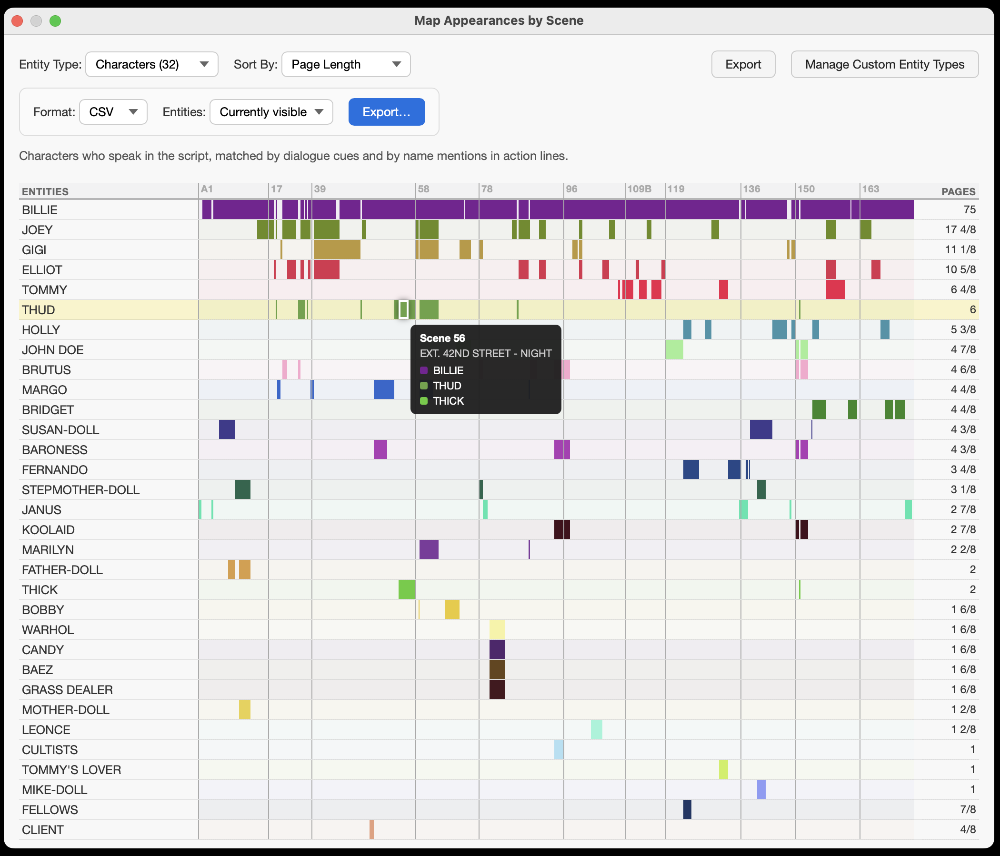

# Map Appearances by Scene

A [Beat](https://kapitan.fi/beat/) plugin that renders a visual timeline of which scenes each "entity" appears in — characters, locations, hashtags, or user-defined regex patterns. Scene cells are sized by page length, colored per entity, with hover tooltips and CSV/JSON export.

## Files

- `plugin.js` — computes scene/entity data from the document and persists settings. Kept thin: no user-interaction or validation logic.
- `ui.html` — the results window: timeline table, type/sort controls, tooltips, export.
- `manage_entity_types.html` — the "Manage Custom Entity Types" window; add/delete/validate regex patterns client-side.
- `shared_helpers.js` — pure helpers used by both windows. Inlined into their `` placeholders by `renderTemplate`, and `require()`d by `tests.js` — so it must stay free of DOM/Beat references and must never contain the literal text `</script>`.
- `tests.js` — unit tests for `plugin.js` and `shared_helpers.js`, no framework.

## How it works

`plugin.js` runs top-to-bottom once, then stays resident for window callbacks:

1. Read custom patterns from user defaults.
2. Build `sceneData`, keyed by scene number, with an integer `index` for script order (scene numbers can be alphanumeric like "A1" — never sort by them).
3. Run every generator in `BUILTIN_ENTITY_TYPES`, then one regex generator per custom pattern. Everything funnels through `addSceneForEntity`, which accumulates scenes, page-eighths, and first appearance per entity. Colors are a deterministic hash of the entity key.
4. `renderTemplate` injects the data as JSON into `ui.html`'s placeholders and opens the window. All types are generated up front; the dropdown only filters rows.
5. HTML windows call back to Beat via `Beat.custom` and `Beat.call` connection.

Entities are computed only at plugin start, so when the user modifies their defined RegEx patterns, the plugin notifies them that they must restart and ends the session.

## Adding a built-in entity type

Add one entry to `BUILTIN_ENTITY_TYPES` in `plugin.js`: `{ name, description, generate }`, where `generate` calls `addSceneForEntity(entityName, scene, typeName)` for every appearance. The dropdown, counts, descriptions, and reserved names all derive from the registry. Custom entity types need no code at all — users define them as regex patterns in the manage window.

## Conventions

- `plugin.js` generates and persists data; the HTML windows own interaction and validation.
- Both windows use real `<table>` markup restyled with `display` overrides — and since those overrides strip table semantics, explicit ARIA roles add them back for screen readers. The timeline's scene cells are decorative (`aria-hidden`) with an `.sr-only` text equivalent in the cell.

## Unit Testing

Run `node tests.js` after changing `plugin.js` or `shared_helpers.js`. The tests evaluate `plugin.js` against a mocked `Beat` global and a fixture screenplay. Logic in the HTML files is not unit-tested. 

## Credits

Based on *Map Character Appearances* by Lauri-Matti Parppei, with parts by Anthony James Huben. 

Written with the assistance of AI tools, primarily Claude.
